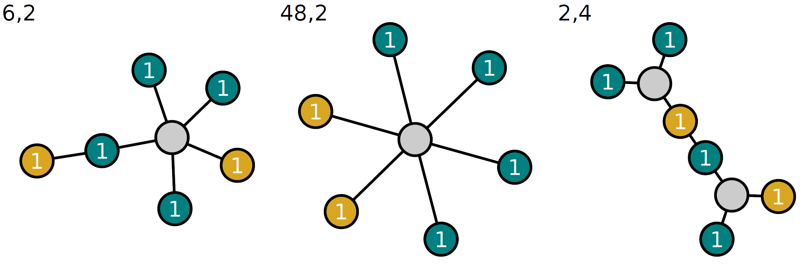

# TorelliTrees

This [Julia](https://julialang.org/) package is used for some computations in the paper "Torelli loci, product cycles, and the homomorphism conjecture for ${\mathcal{A}_g}$" by Samir Canning, Lycka Drakengren, Jeremy Feusi, Daniel Holmes, Aitor Iribar López, Denis Nesterov, Dragos Oprea, Rahul Pandharipande, Johannes Schmitt, and Zheming Sun.
It produces [admcycles](https://pypi.org/project/admcycles/) code that, when executed, computes

$$\mathrm{Tor}^*[\mathcal{A}_{g_1}\times\cdots\times \mathcal{A}_{g_k}]\in R(\mathcal{M}_{g}^\mathrm{ct})$$

where $g=g_1+\dots+g_k$ and $\mathrm{Tor}:\mathcal{M}_g^\mathrm{ct}\rightarrow \mathcal{A}_g$ is the Torelli map.
It also illustrates the decorated stable trees indexing the relevant strata.
Here are some examples for $k=2, g_1=2,g_2=4$:

## Installation

To install the latest version of this package, first install [Julia](https://julialang.org/).
To install the `TorelliTrees` package, launch Julia and execute

    using Pkg
    Pkg.add(url="https://github.com/dh604/TorelliTrees.jl")

Once the package is installed, you can load it with

    using TorelliTrees

## Functionality

This package exports four main functions: `stratum_trees`, `compute_contributions`, `adm_code`, `adm_code_hodge`, and `adm_code_multithread`.

### Step 1: Generating stratum trees using `stratum_trees`

This function returns the collection of stratum trees that are relevant for the computation of

$$\mathrm{Tor}^*[\mathcal{A}_{g_1}\times\cdots\times\mathcal{A}_{g_k}].$$

It also computes the smoothing relations between all of those trees.
For example, to generate the trees for $k=2, g_1=1, g_2=5$, use the following code in Julia:

    T15 = stratum_trees([1, 5])

#### Drawing pictures:
To export pdf files of the generated trees, use the optional argument `draw` together with the argument `folder_name`. This will produce LaTeX code to include the generated pictures into a LaTeX document, assuming the generated pictures will be placed in the folder `folder_name`.
For example, the code

    T15 = stratum_trees([1, 5]; draw=true, folder_name="A1A5/")

produces the relevant trees for $\mathrm{Tor}^*[\mathcal{A}_1\times\mathcal{A}_5]$ and produces pdf files `tree_1.pdf`, `tree_2.pdf`, etc. in the current directory.
It also prints the LaTeX code, assuming that those pdf files will be placed in the folder `A1A5/` relative to the LaTeX file.

### Step 2: Computing contributions using `compute_contributions`

To compute the polynomial $\mathrm{Cont}_T$ in the edge variables and Chern classes of the normal bundle for each $T$, simply run

    compute_contributions(T15)

### Step 3: Exporting `admcycles` code using `adm_code`

To obtain the admcycles code, execute

    adm_code(T15, "A1A5", "A1A5")

The first `"A1A5"` argument is a prefix used to name the variables in the sage file.
The second `"A1A5"` argument means that the output will be a file called `A1A5.sage`.

Executing this sage file will produce a variable called `Torelli_pullback`, which is precisely

$$\mathrm{Tor}^*[\mathcal{A}_{g_1}\times\cdots\times \mathcal{A}_{g_k}].$$

### Remark on `adm_code_hodge`

The function `adm_code_hodge` is a modified version of `adm_code` optimized for checking if

$$\mathrm{Tor}^*[\mathcal{A}_2\times\mathcal{A}_{g-2}]$$

agrees with the tautological projection formula.
It produces a sage file that, when executed, computes the $\lambda_g$ evaluation of

$$\kappa_1\cdot\mathrm{Tor}^*[\mathcal{A}_2\times\mathcal{A}_{g-2}]$$

efficiently using the `admcycles` function `hodge_integrals`.
The result is stored in a file.
For example, the following code creates the sage file `A2A4_hodge.sage` which, when executed, computes the case $(2, 4)$ and stores the result in the file `A2A4_k1_integral.txt`.

    T24 = stratum_trees([2, 4])
    compute_contributions(T24)
    adm_code_hodge(T24, "A2A4", "A2A4_hodge")

### Remark on `adm_code_multithread` (deprecated, use `adm_code_hodge` instead)

The function `adm_code_multithread` is a (deprecated) modified version of `adm_code` optimized for checking if

$$\mathrm{Tor}^*[\mathcal{A}_2\times\mathcal{A}_{g-2}]$$

agrees with the tautological projection formula.
It produces a specified number of sage files that can run in parallel.
The output of each file is a rational number.
Summing those gives the $\lambda_g$-evaluation of 

$$\kappa_1\cdot\mathrm{Tor}^*[\mathcal{A}_2\times\mathcal{A}_{g-2}].$$

To compute the case $(2, 4)$ with 3 parallel threads, use

    T24 = stratum_trees([2, 4])
    compute_contributions(T24)
    adm_code_multithread(T24, "A2A4", "A2A4", 3)

## Exampes

The folder `output` contains the resulting sage files for a number of small cases.